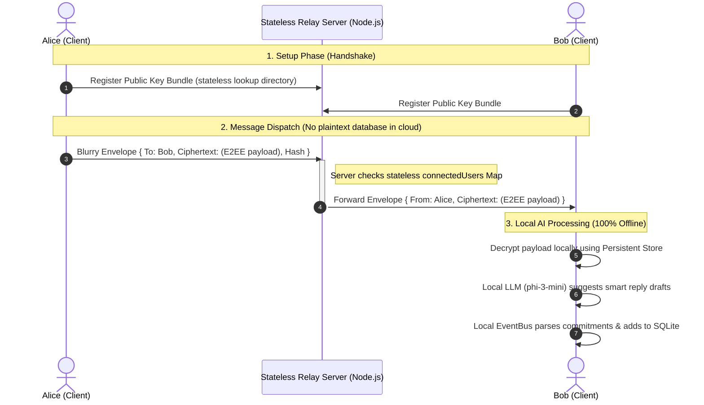

# PIM: Technical Roadmap & Implementation Plan

This document outlines the multi-phase engineering plan to stabilize, scale, and secure **PIM** (Private Intelligence Messenger). It covers the transition from our current local state-managed MVP skeleton to a highly robust, quantum-safe, E2E encrypted mobile application featuring offline-first local AI processing.

---

## Current Base Maturity (Self-Audit)
1.  **UI & Navigation:** Advanced React Navigation stack (`Home`, `Chat`, `Profile`, `Settings`, `Commitments`) styled via NativeWind v4 (Tailwind).
2.  **State Management:** Reactive Zustand stores configured for chats, settings, and commitment tracking.
3.  **Storage:** WatermelonDB SQLite schema with CryptoJS field-level AES encryption at-rest.
4.  **E2EE Base:** Initial Signal protocol bindings and secure hardware storage routines implemented.
5.  **Signal Persistence:** Fully persistent cryptographic database store (`PersistentSignalProtocolStore`) mapping sessions, prekeys, and identities to encrypted local storage.
6.  **Backend Relay:** Operational Node.js Socket.io server brokering key uploads and message routing.

---

## Phase 0: Stabilization (Completed / In Progress)
*   **Repo Purge:** Deleted unrelated Python agentic templates (`src/`, `tests/`, etc.) from the workspace.
*   **E2EE Store Persistence:** Designed and fully integrated the WatermelonDB-backed Signal session database store.
*   **Plaintext Compatibility Fallback:** Rewrote decryption getters to safely support both plaintext fallback and future native database migrations without data loss.

---

## Phase 1: End-to-End Messaging Reliability (Next 2-3 Weeks)
*   **Objective:** Transform PIM into a bulletproof 1:1 E2EE chat client with active key directories, out-of-order message skipping, and robust network reconnection handling.

### Granular Tasks
1.  **Task 1.1: Prekey Bundle Generation & Upload Routine**
    *   *Focus:* Build the complete Signal cryptographic initialization stack for a new device.
    *   *Approach:* Upon first launch, generate `IdentityKeyPair`, `RegistrationId`, `SignedPreKey`, and a block of 100 `OneTimePreKeys` via `IdentityService`. Package their public keys and register them securely via the backend relay's `register-keys` socket event.
    *   *Files:* `app/services/auth/IdentityService.ts`, `app/services/messaging/MessageRelay.ts`.
2.  **Task 1.2: Interactive Handshake Client SessionBuilder Integration**
    *   *Focus:* Initiate cryptographic sessions dynamically before dispatching first message.
    *   *Approach:* When a user initiates a chat with a new ID, check if a session exists in the persistent store. If not, trigger a `fetch-keys` event to obtain the recipient's prekey bundle, pass it to `SessionBuilder.processPreKey` to generate the session record, and store it.
    *   *Files:* `app/services/messaging/EncryptionService.ts`, `app/services/messaging/MessageRelay.ts`.
3.  **Task 1.3: Out-of-Order Packet Delivery (Message Key Skipping)**
    *   *Focus:* Prevent decryption failure when packets arrive out of sequence due to cellular handover.
    *   *Approach:* Rely on `libsignal` skipped message keys management. Ensure that if a message is skipped, its ephemeral key is skipped and written to the database for later decryption, preventing ratcheting desynchronization.
    *   *Files:* `app/services/messaging/EncryptionService.ts`.
4.  **Task 1.4: One-Time Prekey Replenishment**
    *   *Focus:* Prevent "exhausted prekey" warnings for highly active contacts.
    *   *Approach:* Monitor remaining registered `OneTimePreKeys`. When the count drops below 20, generate 80 new keys in the background and upload them to the relay server to replenish the user's pool.
    *   *Files:* `app/services/auth/IdentityService.ts`, `app/services/messaging/MessageRelay.ts`.
5.  **Task 1.5: Offline Message Queue & WebSocket Reconnection Backoff**
    *   *Focus:* Robust message synchronization upon reconnection.
    *   *Approach:* Implement exponential backoff for Socket.io client reconnect attempts. Once connected, automatically query the local DB queue and sequential-drain (`processOfflineQueue`) while ensuring duplicate receipts are ignored.
    *   *Files:* `app/services/messaging/MessageRelay.ts`.
6.  **Task 1.6: Interactive Safety Numbers (Key Verification UI)**
    *   *Focus:* Provide a human-in-the-loop mechanism to verify contact identity.
    *   *Approach:* Render fingerprints (SHA-256 hashes of combined identity keys) on a modal inside `ChatScreen` or `ProfileScreen`. Include a QR code scanning feature utilizing `expo-camera` to compare public keys.
    *   *Files:* `app/screens/ChatScreen.tsx`, `app/screens/ProfileScreen.tsx`.
7.  **Task 1.7: Teardown Protection & Active Chat Transaction Hooks**
    *   *Focus:* Ensure no message is lost if the OS closes the app during database write.
    *   *Approach:* Wrap database insertions in strict SQLite transactions. Maintain transient message status states (Zustand: `sending`) and re-check pending queues on subsequent app boots.
    *   *Files:* `app/services/storage/LocalDb.ts`, `app/services/storage/StateManager.ts`.

### Security & Performance
*   *Security:* Prekeys must be deleted from local storage immediately after they are consumed during the DH handshake to protect forward secrecy.
*   *Performance:* Keep key generation asynchronous inside native background threads. Do not execute blocking CPU-heavy RSA/Curve keygen on the Javascript main UI loop.

### Acceptance Criteria
*   Users can close and reopen the app mid-conversation; sessions load persistently without requiring a new cryptographic handshake.
*   Simulated offline network state (switching cell connection on/off) automatically queues messages and drains them in order without duplicates.

---

## Phase 2: Local AI Integration & Polish
*   **Objective:** Bring offline, hardware-accelerated intelligence to PIM. Ensure models load dynamically without dropping frames or blocking rendering.

### Granular Tasks
1.  **Task 2.1: Asynchronous Model Downloader & Verification Utility**
    *   *Focus:* Securely cache and verify local LLM weights.
    *   *Approach:* Implement a file download routine inside `AiAdvisor.ts` using `expo-file-system`. Download the 2.2GB `phi-3-mini-Q4_K_M.gguf` file to the app's documents directory, verifying its integrity via SHA-256 hash checks.
    *   *Files:* `app/services/ai/AiAdvisor.ts`.
2.  **Task 2.2: Native Threading & JSI Execution (No UI Lockups)**
    *   *Focus:* Native offloading of LLM inference.
    *   *Approach:* Configure `llama.rn`'s native JSI engine to perform model loading and inference strictly in an background C++ worker thread, ensuring the main JS UI thread renders at a smooth 60/120 FPS.
    *   *Files:* `app/services/ai/AiAdvisor.ts`.
3.  **Task 2.3: Opt-in UI Toolbar for Smart Draft Suggestions**
    *   *Focus:* Prevent AI from auto-sending messages.
    *   *Approach:* Implement an elegant horizontal slider toolbar above the message input field. On new incoming messages, generate a short reply draft, display it on the toolbar, and insert it as an editable draft *only* when clicked.
    *   *Files:* `app/screens/ChatScreen.tsx`, `app/components/ReplySuggestions.tsx` (or inside ChatScreen).
4.  **Task 2.4: Local Tone Classification Prompt Optimization**
    *   *Focus:* Analyze conversational safety and emotion offline.
    *   *Approach:* Write structured, low-token system prompts for the quantized Llama model to classify emotional tone (e.g. neutral, happy, anxious, defensive) in less than 30 tokens, updating the UI subheader.
    *   *Files:* `app/services/ai/ToneDetector.ts`.
5.  **Task 2.5: Commitments & Actionable Tasks Parser**
    *   *Focus:* Dynamically extract deadlines and tasks.
    *   *Approach:* Set up an EventBus listener on `message.secure-received`. When a message lands, format a prompt asking the model to parse promises (e.g., "I will review this by 4 PM"). If a task is found, insert it into `useCommitmentStore`.
    *   *Files:* `app/services/ai/AiAdvisor.ts`, `app/stores/useCommitmentStore.ts`.
6.  **Task 2.6: SQLite Vector Semantic Database (Memory Index Conversion)**
    *   *Focus:* Make conversational index persistent.
    *   *Approach:* Refactor the transient in-memory `MemoryIndex.ts` into an encrypted database schema inside `LocalDb.ts`. Store high-dimensional embeddings (e.g., 384-dim) as strings or binary blobs to execute persistent cosine-similarity vector queries.
    *   *Files:* `app/services/ai/MemoryIndex.ts`, `app/services/storage/LocalDb.ts`.

### Security & Performance
*   *Security:* LLM model context is purged from RAM instantly upon exiting a chat session. No context history is ever written in cleartext to local disk cache.
*   *Performance:* Limit max token production to 40-50 tokens to ensure responses return in under 2 seconds on modern smartphones (Neural Engines).

### Acceptance Criteria
*   The keyboard remains fully responsive and animations remain smooth (no lagging or frame drops) while the local model compiles reply suggestions.
*   Tasks extracted by the AI are permanently visible inside `CommitmentsDashboard` across app reloads.

---

## Phase 3: Quantum Safety Integration
*   **Objective:** Future-proof PIM's encryption architecture against quantum decryption threats by integrating post-quantum key encapsulation mechanisms.

### Granular Tasks
1.  **Task 3.1: Hybrid Post-Quantum Key Exchange Protocol Design**
    *   *Focus:* Implement a dual-secret derivation mechanism.
    *   *Approach:* Design a hybrid protocol combining the classic **X25519** ECDH key exchange with **ML-KEM-768** (Kyber-768). Derive the master session key using a Key Derivation Function (KDF like HKDF-SHA256) acting on the concatenation of *both* shared secrets: `KDF(X25519_Secret || ML-KEM_Secret)`. This guarantees safety even if either algorithm is mathematically broken.
    *   *Files:* `app/services/messaging/EncryptionService.ts`.
2.  **Task 3.2: Crypto-Agile Header & Payload Specification**
    *   *Focus:* Dynamic packet protocol expansion.
    *   *Approach:* Structure message headers to support customizable version tags (e.g. `v1_classic_x25519`, `v2_hybrid_kem`). The backend relay routes these packets blindly without needing to interpret the cryptographic schema version.
    *   *Files:* `app/services/messaging/MessageRelay.ts`, `backend/server.ts`.
3.  **Task 3.3: Native ML-KEM Bindings Integration**
    *   *Focus:* High-performance post-quantum cryptography on mobile.
    *   *Approach:* Integrated verified Rust/C implementation of ML-KEM-768 via React Native JSI or Native Modules (`expo-crypto` polyfills or custom JSI binders), providing high-speed encapsulation and decapsulation interfaces.
    *   *Files:* `app/services/auth/IdentityService.ts`, `app/services/messaging/EncryptionService.ts`.
4.  **Task 3.4: PQXDH PreKey Bundle Expansion**
    *   *Focus:* Expand key directories with quantum-safe credentials.
    *   *Approach:* Modify registration and bundle fetching schemes to include ML-KEM public key components (KEM public key, KEM signed prekey, signature).
    *   *Files:* `app/services/auth/IdentityService.ts`, `backend/server.ts`.
5.  **Task 3.5: Hybrid Key Ratcheting Routine**
    *   *Focus:* Infuse post-quantum secrets into the continuous Double Ratchet.
    *   *Approach:* Inject new hybrid KEM shared secrets during key ratcheting iterations instead of standard DH ratchets alone, preventing retrospect retroactive decryption.
    *   *Files:* `app/services/messaging/EncryptionService.ts`.

### Security & Performance
*   *Security:* ML-KEM implementation must use constant-time operations to defend against side-channel timing analysis attacks.
*   *Performance:* Keep ML-KEM public keys small (ML-KEM-768 public keys are roughly 1184 bytes), preserving light network transit.

### Acceptance Criteria
*   The handshake successfully derives identical hybrid keys on both Alice and Bob's devices using the combined X25519 + ML-KEM protocol.
*   Classic messaging remains completely functional for legacy clients while quantum-safe headers dynamically negotiate higher-tier encryption schemes on compatible devices.

---

## Phase 4: Groups, Media, Advanced Features
*   **Objective:** Layer on typical consumer chat requirements—including group messaging, media encryption, screenshot alerts, and self-destructing data.

### Granular Tasks
1.  **Task 4.1: Cryptographic Group Messaging via Sender Keys (Double Ratchet Groups)**
    *   *Focus:* Prevent client-side packet duplication in groups.
    *   *Approach:* Implement the Signal Group Sender Key protocol. Each participant generates their own chain of Sender Keys locally and distributes it securely to other group members over E2EE 1:1 channels. Subsequent group messages are encrypted with the sender's current ratcheted group key, cutting overhead from $O(N)$ encrypts to $O(1)$.
    *   *Files:* `app/services/messaging/EncryptionService.ts`, `app/services/messaging/MessageRelay.ts`.
2.  **Task 4.2: Local Audio Voice Notes Encryption & Playback**
    *   *Focus:* E2EE voice notes.
    *   *Approach:* Record audio in AAC/m4a formats using `expo-av`. Generate a single-use random symmetric key (AES-256-GCM), encrypt the audio file locally, write the encrypted bytes to a temporary directory, upload to a stateless file host, and send the file URL and AES key over the secure chat channel.
    *   *Files:* `app/components/ChatThread.tsx`, `app/screens/ChatScreen.tsx`.
3.  **Task 4.3: Secure Image Encryption & Verification**
    *   *Focus:* E2EE image attachments.
    *   *Approach:* Follow the symmetric file encryption pipeline for images captured via `expo-image-picker`. Render the preview locally by decrypting the image payload in memory on-the-fly and loading the raw decrypted buffer into image containers.
    *   *Files:* `app/components/ChatThread.tsx`, `app/screens/ChatScreen.tsx`.
4.  **Task 4.4: Ephemeral Database Purge (Self-Destruct Queries)**
    *   *Focus:* Secure automated deletion of physical data.
    *   *Approach:* Update `ChatScreen`'s interval logic. Query the WatermelonDB SQLite database for messages where `expiresAt < now`, and execute database purges immediately.
    *   *Files:* `app/screens/ChatScreen.tsx`, `app/services/storage/LocalDb.ts`.
5.  **Task 4.5: Native Screenshot Alerts (Privacy Safeguards)**
    *   *Focus:* Alert chat participants about local screenshot captures.
    *   *Approach:* Extend the native event listener wrapper for `expo-screen-capture`. When a screenshot event fires, construct an encrypted alert packet, send it via the relay socket, and display it as an inline system warning in the active chat.
    *   *Files:* `app/screens/ChatScreen.tsx`, `app/services/messaging/MessageRelay.ts`.

### Security & Performance
*   *Security:* Symmetric media encryption keys must *never* be shared with the file-hosting server. They must reside strictly inside the end-to-end encrypted packet payload.
*   *Performance:* Use stream-based encryption chunking for media payloads over 5MB to avoid out-of-memory crashes on resource-constrained devices.

### Acceptance Criteria
*   Voice notes and images render beautifully on the recipient client only after successful secure decryption, without lag.
*   Self-destruct timers physically delete the SQLite record from the device's storage and do not leave behind orphan cache files.

---

## Phase 5: Testing, Security Audit Prep, Release
*   **Objective:** Verify architectural integrity, run simulated adversary stress tests, prepare cryptographic auditing metrics, and compile native bundles.

### Granular Tasks
1.  **Task 5.1: Network Partitioning & Synchronization Stress Tests**
    *   *Focus:* Guarantee database and socket consistency during extreme packet loss.
    *   *Approach:* Write integration mock scripts simulating rapid online/offline handovers and race conditions (e.g. sending 100 messages while flickering network access). Verify that WatermelonDB queues and ratchets maintain complete synchronization.
    *   *Files:* `app/services/FullFlowTest.ts`.
2.  **Task 5.2: Cryptographic Audit Trail & Key Lifecycle Logging**
    *   *Focus:* Verify cryptographic key rotation correctness.
    *   *Approach:* Configure a secure dev-only logging module showing key rotation, PreKey consumption, and KDF iterations. Audit this trace to ensure no private key or intermediate secret is leaked in plaintext logs.
    *   *Files:* `app/services/messaging/EncryptionService.ts`.
3.  **Task 5.3: Strict Dependency Audit & Vulnerability Mitigation**
    *   *Focus:* Safeguard the supply chain.
    *   *Approach:* Run `npm audit` and configure strict version locking in `package.json` for all low-level crypto packages (`libsignal`, `crypto-js`, etc.) to defend against dependency injection attacks.
    *   *Files:* `app/package.json`.
4.  **Task 5.4: Production Build Bundling & Native EAS Compilations**
    *   *Focus:* Compile optimized production apps.
    *   *Approach:* Set up native signing profiles inside Expo Application Services (EAS). Execute `eas build --platform ios` and `eas build --platform android` to generate optimized production binaries for TestFlight and Google Play distribution.
    *   *Files:* `app/app.json`, `app/eas.json`.

---

## Architectural Summary: Metadata Hygiene (Zero Cloud Footprint)

