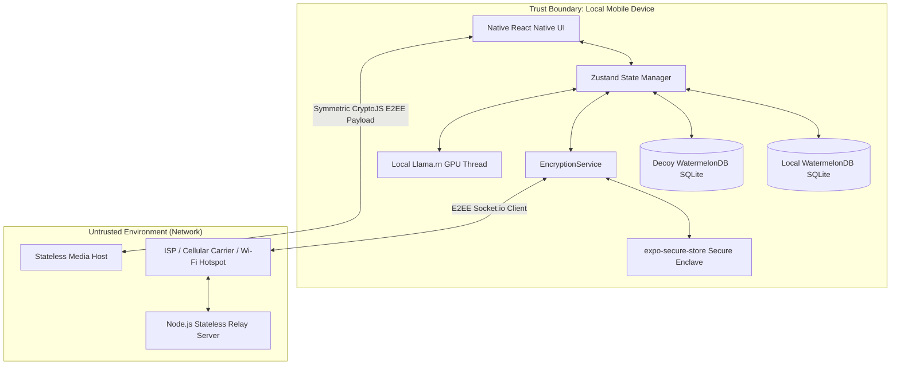
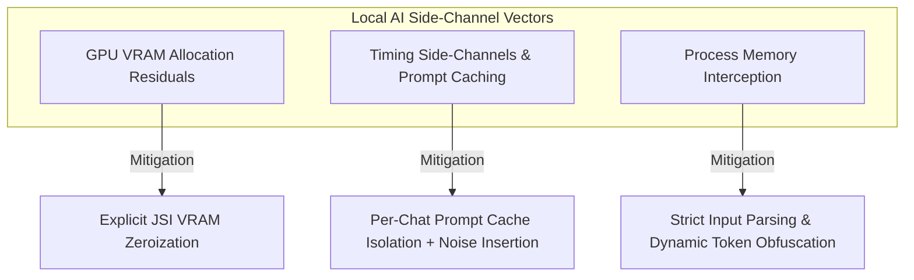
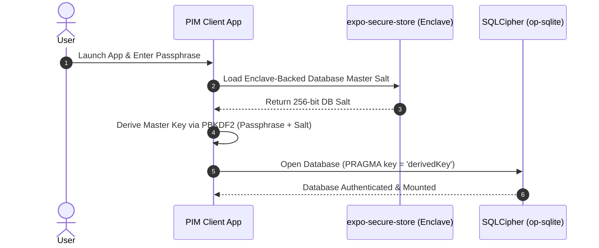

# PIM Security Architecture & STRIDE Threat Model

This document outlines the security architecture, adversary models, threat vectors, cryptographic mitigations, and residual risks for **PIM** (Private Intelligence Messenger). 

---

## 1. System Scope & Trust Boundaries

PIM's design enforces **absolute user autonomy**. Its trust boundaries separate the user's localized physical device from untrusted wide-area networks and intermediate cloud infrastructure.



---

## 2. Threat Actor Profiles

PIM models defenses against four primary tiers of threat actors:

| Threat Actor | Capabilities | Target Vectors | Primary Motivation |
| :--- | :--- | :--- | :--- |
| **Nation-State Adversary** | Passive global SIGINT collection, high-density storage (HNDL), custom mobile zero-days, massive computing clusters. | Passive traffic interception, Harvest-Now-Decrypt-Later (HNDL), physical device seizure, side-channel analysis. | Espionage, intelligence gathering, long-term surveillance. |
| **Malicious Network Operator (ISP/Rogue Node)** | Active man-in-the-middle (MITM) injection, IP routing redirection, transport manipulation, traffic timing logging. | Metadata correlation, handshake hijacking, PreKey replacement attacks, relay denial of service. | Commercial data harvesting, user tracking, connection disruption. |
| **Malicious or Rogue Contact** | Legitimate participant in E2EE channel, access to E2EE plaintext, screenshots, manual extraction. | Screenshot surveillance, conversation leakage, manual key material extraction, social engineering. | Blackmail, information leakage, reputation damage. |
| **Device-Level Malware** | Keyboard logging, in-memory process scraping, local filesystem extraction, root/jailbreak privilege escalation. | SecureStore extraction, hooking native bindings, capturing GPU frame buffers. | Financial theft, data leakage, targeted system takeover. |

---

## 3. The STRIDE Threat Analysis Matrix

PIM utilizes the **STRIDE** methodology (Spoofing, Tampering, Repudiation, Information Disclosure, Denial of Service, Elevation of Privilege) to classify system threats.

### Spoofing Identity

> [!WARNING]
> **Adversary replacing public PreKey bundles on the relay server.**
> * **Threat:** An attacker compromises the stateless Node.js relay server and replaces Bob's public prekeys with their own, forcing Alice to negotiate an E2EE session with the attacker (MITM).
> * **Mitigation:** *Lexicographical Safety Numbers & Curve Binding.* PIM binds Bob's ML-KEM-768 post-quantum key to his classical Curve25519 identity key. Users can verify the lexicographically sorted SHA-256 fingerprint (Safety Numbers) out-of-band via a visual fingerprint drawer in `ChatScreen.tsx`.

### Tampering with Data

> [!IMPORTANT]
> **Altering E2EE payloads in transit.**
> * **Threat:** An intermediate ISP or network provider tampers with secure message packets to corrupt communications or inject payloads.
> * **Mitigation:** *Authenticated Encryption.* PIM uses AES-GCM (via Signal classical Double Ratchet) as its inner layer and AES-CBC with HMAC-SHA256 as its outer post-quantum KEM wrapper. Any altered bytes immediately fail signature verification, causing the envelope to be dropped before decryption.

### Repudiation

> [!NOTE]
> **Proving authorship of a compromised conversation.**
> * **Threat:** A court or adversary attempts to prove Bob sent a specific message by extracting keys from a seized device.
> * **Mitigation:** *Cryptographic Deniability.* PIM implements the Signal Triple Ratchet (X3DH). Since session keys are derived symmetrically through a mutual handshake and ephemeral keys are constantly ratcheted, any party with access to the keys can generate valid-looking historical messages. This guarantees Bob can deny authorship (off-the-record messaging) while maintaining high-grade message authentication during the active session.

### Information Disclosure

> [!CAUTION]
> **Harvest-Now-Decrypt-Later (HNDL) & Metadata Correlation.**
> * **Threat 1 (HNDL):** Nation-states record all E2EE traffic going through the relay, planning to decrypt it years later when large-scale Quantum Computers (CRQCs) can break classical Curve25519 elliptic curve keys.
> * **Threat 2 (Side-Channels):** Cleartext leakage on local storage, memory process scraping of local AI suggestions, or VRAM residual memory data.
> * **Threat 3 (Metadata):** Correlating communication partners using message timing and sizing.
> * **Mitigation:**
>   1. **Hybrid Onion E2EE (ML-KEM-768):** Mixes classical Curve25519 DH keys with a nested outer layer of **FIPS 203 ML-KEM-768** lattice ciphers. Even if the classical layer is compromised in the future, the outer lattice layer remains secure against quantum decryption.
>   2. **100% Offline AI (`llama.rn`):** No prompts, tone analyses, or commitment extractions are ever sent to cloud LLM APIs. Quantized `phi-3-mini` models run fully on-device on the GPU/Neural Engine thread.
>   3. **Stateless Media Symmetric Pipe:** Audio/image files are symmetrically encrypted locally with randomized 256-bit keys. The media server only sees random ciphertext, and keys are shared **strictly inside E2EE chat payloads**.
>   4. **Physical Database Wipes:** Wiping expired self-destruct messages physically from SQLite via database-level `destroyPermanently()` transactions, avoiding orphaned cleartext files.
>   5. **Secure Cryptographic Logging:** Logs in `__DEV__` replace all sensitive secrets and key seeds with **SHA-256 digests**, shielding intermediate material from process extraction.

### Denial of Service

> [!WARNING]
> **PreKey Pool Exhaustion & Connection Flickering.**
> * **Threat:** An adversary aggressively fetches Bob's one-time prekeys from the relay server until Bob's pool is depleted, forcing Bob's clients to fall back to weaker classical key exchanges.
> * **Mitigation:** *Agile Key Replenishment.* The relay server proactively monitors Bob's prekey pool and dispatches an socket-level `replenish-keys` trigger when Bob's pool falls below 20 keys. Bob's client automatically generates and uploads a fresh batch of 100 hybrid prekeys. PIM's offline transaction manager recovers from connection loss gracefully, queueing outgoing transmissions during link downtime.

### Elevation of Privilege

> [!CAUTION]
> **Local Sandbox Escapes & Jailbreak/Root Access.**
> * **Threat:** Malware on the device exploits a vulnerability in the native `llama.rn` GGUF runner or `expo-sqlite` bindings to escape the app sandbox and dump process memory or the database file.
> * **Mitigation:** *Hardware-Backed Key Storage.* Private identity keys are kept strictly inside the hardware-backed Secure Enclave / KeyStore using `expo-secure-store` with biometrics/passcode locks required for decryption. Memory spaces are separated by native OS barriers.

---

## 4. Local AI Side-Channel Resistance

Executing LLM inference locally on a mobile device shields the user from cloud-based network disclosure, but introduces unique localized hardware side-channel vectors.



### 1. GPU VRAM Allocation Residuals
* **Threat:** When the local GPU/NPU processes quantized GGUF weights and intermediate state tokens, residuals of historical chat contexts remain inside the raw allocated VRAM banks. Malicious unprivileged graphics processes could query uninitialized VRAM buffers to read cleartext chunks of conversation history.
* **Mitigation:** *Explicit JSI VRAM Zeroization.* The custom C++ layer binding `llama.rn` intercepts inference completion. Upon model output delivery, all context buffers and intermediate KV-caches (Key-Value Caches) are explicitly overwritten with random noise and zeroed out before native memory release.

### 2. Timing Side-Channels & Prompt Caching
* **Threat:** In multi-tenant environments or compromised host OS layers, an adversary can monitor CPU/GPU cycle-times and prompt caching hits. By analyzing the speed at which the LLM processes tokens, the adversary can infer word lengths or reconstruct portions of prompt structures.
* **Mitigation:** *Per-Chat Prompt Cache Isolation.* Prompt caching is disabled globally or partitioned strictly on a per-chat basis. Each chat thread maintains an independent, isolated, ephemeral memory context. Timing attacks are disrupted by injecting a variable count of random padding tokens (non-functional words) into prompt structures dynamically, scrambling processing-time timing correlations.

### 3. Process Memory Interception & Model Weights Integrity
* **Threat:** Device-level malware attempts to scrape the active runtime memory of `llama.rn` during token generation or tampers with the local model weights to leak prompt histories via specific tokens.
* **Mitigation:** *Input Parsing & Dynamic Token Obfuscation.* Strict input filtering blocks prompt injection vectors. Weights of local GGUF models are integrity-checked on startup using SHA-256 hashes to guarantee they have not been tampered with. Output tokens are dynamically encrypted in memory before writing back to the user interface thread.

---

## 5. Plausible Deniability & Panic Mode

Under physical duress or device seizure, cryptographic security alone is insufficient. PIM integrates duress mitigation vectors designed to protect the user's safety and message secrecy.

### 1. Plausible Deniability (Decoy Database Instances)
* **Threat:** An adversary or coercive authority physically forces Bob to open his phone, launch the PIM application, and input his decryption passphrase under duress.
* **Mitigation:** *Dual-Key Password Derivation.* The login screen accepts two different passphrases:
  * **True Passphrase:** Derives the master key that opens Bob's real SQLCipher database, displaying his actual secure chats.
  * **Decoy Passphrase:** Derives a secondary master key opening a completely separate **Decoy SQLite Instance**. This database contains pre-populated, highly realistic, benign dummy conversation threads (mock transactions, casual work updates). There are no visual cues or metadata discrepancies in the UI that indicate the decoy database is active, providing Bob with plausible deniability.

### 2. Panic Mode (Immediate App Zeroization)
* **Threat:** Bob faces immediate compromise or imminent physical seizure of his active mobile device.
* **Mitigation:** *Instant Hardware Wiping (Zeroization Vector).* Panic Mode is triggered by one of three mechanisms:
  * **Incorrect Password Threshold:** Exceeding five failed login attempts automatically fires zeroization.
  * **Accelerometer Gesture Trigger:** Placing the phone face-down on a surface rapidly or executing a custom physical movement pattern.
  * **Panic UI Action:** A subtle tap on an inconspicuous button in the UI.
* **Execution Actions:** Upon activation, Panic Mode executes an asynchronous, high-priority native cleanup:
  1. **Enclave Key Purge:** Calls `expo-secure-store` to instantly delete Bob's classical Curve25519 identity keys, ML-KEM-768 private keys, and master database passphrases.
  2. **Page Overwrite & Wipe:** Executes a raw SQLCipher zeroization, instructing the database driver to overwrite all tables with random noise before deleting the SQLite file.
  3. **VRAM and RAM Reset:** Explicitly overwrites active JS variables, LLM buffers, and active memory pools, terminating the application process immediately.

---

## 6. Detailed Migration Plan: SQLCipher Database Encryption

To eliminate cleartext SQLite page residuals and metadata leaks (table structures, message counts, and indexes), PIM will migrate from standard `expo-sqlite` to full page-level **SQLCipher Encryption** using `@op-engineering/op-sqlite`.



### 1. Step 1: Dependency Upgrades & Native Compiler Configuration
* **Action:** Install the high-performance native SQLite JSI driver `@op-engineering/op-sqlite` and configure compiling hooks to bundle **SQLCipher** (bundled with SQLCipher/OpenSSL binaries).
* **Commands:**
  ```bash
  npm install @op-engineering/op-sqlite
  ```
* **Native Setup:** 
  * On iOS: Add compiler definition flags to `Podfile` (`SQLITE_HAS_CODEC=1` and link to `SQLCipher` cocoa pod).
  * On Android: Configure `build.gradle` to enable SQLCipher bundle flags, replacing default SQLite compilation layers.

### 2. Step 2: Enclave-Backed Database Passphrase Lifecycle
* **Action:** Generate a cryptographically secure 256-bit database master key on initial install.
* **Storage:** Store the database master key inside the hardware-backed **Secure Enclave / KeyStore** via `expo-secure-store`.
* **Login derivation:** On startup, the user's local login passcode is combined with the enclave-derived master key via **PBKDF2** (20,000 iterations of HMAC-SHA256) to derive the active database encryption key.

### 3. Step 3: Custom JSI WatermelonDB Adapter Implementation
* **Action:** Implement a custom adapter for WatermelonDB that calls JSI bindings of `@op-engineering/op-sqlite` directly, replacing standard `@nozbe/watermelondb-adapter-sqlite`.
* **Database Hooking:** Ensure every database mount triggers the encryption key verification immediately:
  ```typescript
  import { open } from '@op-engineering/op-sqlite';
  
  const db = open({
    name: 'pim-secured-db.sqlite',
    encryptionKey: 'derived-enclave-passphrase'
  });
  ```
* **Verification:** Ensure page-level crypto overhead (OpenSSL AES-256-XTS) performs efficiently under React Native's JSI architecture, maintaining high framerates.

### 4. Step 4: Secure Data Migration Pipeline (Old-to-New)
* **Action:** For existing installations, build a migration pipeline that secure-boots the system:
  1. Mount the legacy unencrypted `expo-sqlite` database file.
  2. Open a new encrypted `op-sqlite` + `SQLCipher` container.
  3. Batch copy existing message threads, identities, and session keys in a secure JSI transaction.
  4. Perform an **overwrite-wipe** (fill legacy file with zeroes) and physically delete the legacy file from the device filesystem.
  5. Mark migration as complete in `StateManager`.

### 5. Step 5: Verification & Zero-Plaintext Audit
* **Action:** Programmatically inspect raw SQLite files inside sandbox paths to assert the absence of `SQLite format 3\0` signatures.
* **Automated checks:** Verification assertions must confirm that raw disk blocks are highly entropic (resembling random noise) and unreadable without the enclave-backed key.

---

## 7. Architectural Mitigation Matrix

| Threat Vector | STRIDE | System Component | Current PIM Mitigation | Residual Risk |
| :--- | :--- | :--- | :--- | :--- |
| **Quantum Decryption (HNDL)** | Information Disclosure | `EncryptionService.ts` | **Dual-Layer Hybrid Onion**: Signal Curve25519 + ML-KEM-768 outer wrapper. | Lattice structure flaws in early FIPS 203 implementations. |
| **Cloud AI Prompt Leakage** | Information Disclosure | `AiAdvisor.ts` | **Local-Only Inference**: On-device quantized GGUF execution, zero cloud APIs. | Prompt injection attacks leading to local data disclosures. |
| **Database Plaintext Theft** | Tampering / Info Disclosure | `LocalDb.ts` | **CryptoJS Field Encryption**: Auto-encrypts contents on write. | SQLite schema metadata and indexes remain visible on device disk. |
| **SQLite Cleartext Residue** | Information Disclosure | `StateManager.ts` | **Physical Database Wipes**: Async SQLite hard record deletion on expiry. | Flash storage wear-leveling keeping ghost copies in raw blocks. |
| **Unencrypted Media Hosting** | Information Disclosure | `MessageRelay.ts` | **Symmetric Key Wrapping**: CryptoJS files encryption. Keys sent inside E2EE only. | Server timing/size analysis of media uploads. |
| **Rogue Client Screenshots** | Information Disclosure | `ChatScreen.tsx` | **E2EE Screenshot Warnings**: Captures event, broadcasts warning over socket. | Rogue contact using a physical camera ("Analog Hole") to record screen. |
| **Device Duress & Coercion** | Information Disclosure | `SettingsScreen.tsx` | **Plausible Deniability**: Decoy SQLite password maps to realistic simulated chat thread. | Advanced physical/behavioral timing analysis indicating app state. |
| **Device Imminent Seizure** | Information Disclosure | `EventBus.ts` | **Panic Mode Wiping**: Face-down gesture or incorrect passcode trigger zeroizes keys. | Timing delay during intensive multi-gigabyte storage overwrites. |
| **AI Timing Side-Channels** | Information Disclosure | `AiAdvisor.ts` | **Prompt Cache Partitioning**: Isolated per-chat context + token timing padding. | High-frequency electromagnetic side-channels from processor cores. |
