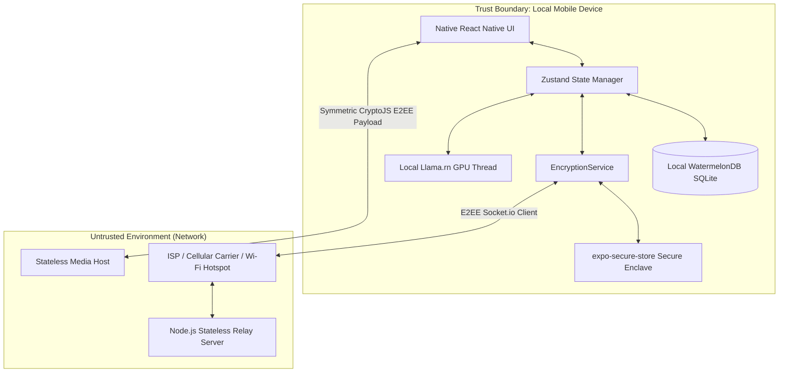

# PIM Security Architecture & STRIDE Threat Model

This document outlines the security architecture, adversary models, threat vectors, cryptographic mitigations, and residual risks for **PIM** (Private Intelligence Messenger). 

---

## 1. System Scope & Trust Boundaries

PIM's design enforces **absolute user autonomy**. Its trust boundaries separate the user's localized physical device from untrusted wide-area networks and intermediate cloud infrastructure.

---

## 2. Threat Actor Profiles

PIM models defenses against four primary tiers of threat actors:

| Threat Actor | Capabilities | Target Vectors | Primary Motivation |
| :--- | :--- | :--- | :--- |
| **Nation-State Adversary** | Passive global SIGINT collection, high-density storage (HNDL), custom mobile zero-days, massive computing clusters. | Passive traffic interception, Harvest-Now-Decrypt-Later (HNDL), physical device seizure, side-channel analysis. | Espionage, intelligence gathering, long-term surveillance. |
| **Malicious Network Operator (ISP/Rogue Node)** | Active man-in-the-middle (MITM) injection, IP routing redirection, transport manipulation, traffic timing logging. | Metadata correlation, handshake hijacking, PreKey replacement attacks, relay denial of service. | Commercial data harvesting, user tracking, connection disruption. |
| **Malicious or Rogue Contact** | Legitimate participant in E2EE channel, access to E2EE plaintext, screenshots, manual extraction. | Screenshot surveillance, conversation leakage, manual key material extraction, social engineering. | Blackmail, information leakage, reputation damage. |
| **Device-Level Malware** | Keyboard logging, in-memory process scraping, local filesystem extraction, root/jailbreak privilege escalation. | SecureStore extraction, hooking native bindings, capturing GPU frame buffers. | Financial theft, data leakage, targeted system takeover. |

---

## 3. The STRIDE Threat Analysis Matrix

PIM utilizes the **STRIDE** methodology (Spoofing, Tampering, Repudiation, Information Disclosure, Denial of Service, Elevation of Privilege) to classify system threats.

### Spoofing Identity

> [!WARNING]
> **Adversary replacing public PreKey bundles on the relay server.**
> * **Threat:** An attacker compromises the stateless Node.js relay server and replaces Bob's public prekeys with their own, forcing Alice to negotiate an E2EE session with the attacker (MITM).
> * **Mitigation:** *Lexicographical Safety Numbers & Curve Binding.* PIM binds Bob's ML-KEM-768 post-quantum key to his classical Curve25519 identity key. Users can verify the lexicographically sorted SHA-256 fingerprint (Safety Numbers) out-of-band via a visual fingerprint drawer in `ChatScreen.tsx`.

### Tampering with Data

> [!IMPORTANT]
> **Altering E2EE payloads in transit.**
> * **Threat:** An intermediate ISP or network provider tampers with secure message packets to corrupt communications or inject payloads.
> * **Mitigation:** *Authenticated Encryption.* PIM uses AES-GCM (via Signal classical Double Ratchet) as its inner layer and AES-CBC with HMAC-SHA256 as its outer post-quantum KEM wrapper. Any altered bytes immediately fail signature verification, causing the envelope to be dropped before decryption.

### Repudiation

> [!NOTE]
> **Proving authorship of a compromised conversation.**
> * **Threat:** A court or adversary attempts to prove Bob sent a specific message by extracting keys from a seized device.
> * **Mitigation:** *Cryptographic Deniability.* PIM implements the Signal Triple Ratchet (X3DH). Since session keys are derived symmetrically through a mutual handshake and ephemeral keys are constantly ratcheted, any party with access to the keys can generate valid-looking historical messages. This guarantees Bob can deny authorship (off-the-record messaging) while maintaining high-grade message authentication during the active session.

### Information Disclosure

> [!CAUTION]
> **Harvest-Now-Decrypt-Later (HNDL) & Metadata Correlation.**
> * **Threat 1 (HNDL):** Nation-states record all E2EE traffic going through the relay, planning to decrypt it years later when large-scale Quantum Computers (CRQCs) can break classical Curve25519 elliptic curve keys.
> * **Threat 2 (Side-Channels):** Cleartext leakage on local storage or memory process scraping of local AI suggestions.
> * **Threat 3 (Metadata):** Correlating communication partners using message timing and sizing.
> * **Mitigation:**
>   1. **Hybrid Onion E2EE (ML-KEM-768):** Mixes classical Curve25519 DH keys with a nested outer layer of **FIPS 203 ML-KEM-768** lattice ciphers. Even if the classical layer is compromised in the future, the outer lattice layer remains secure against quantum decryption.
>   2. **100% Offline AI (`llama.rn`):** No prompts, tone analyses, or commitment extractions are ever sent to cloud LLM APIs. Quantized `phi-3-mini` models run fully on-device on the GPU/Neural Engine thread.
>   3. **Stateless Media Symmetric Pipe:** Audio/image files are symmetrically encrypted locally with randomized 256-bit keys. The media server only sees random ciphertext, and keys are shared **strictly inside E2EE chat payloads**.
>   4. **Physical Database Wipes:** Wiping expired self-destruct messages physically from SQLite via database-level `destroyPermanently()` transactions, avoiding orphaned cleartext files.
>   5. **Secure Cryptographic Logging:** Logs in `__DEV__` replace all sensitive secrets and key seeds with **SHA-256 digests**, shielding intermediate material from process extraction.

### Denial of Service

> [!WARNING]
> **PreKey Pool Exhaustion & Connection Flickering.**
> * **Threat:** An adversary aggressively fetches Bob's one-time prekeys from the relay server until Bob's pool is depleted, forcing Bob's clients to fall back to weaker classical key exchanges.
> * **Mitigation:** *Agile Key Replenishment.* The relay server proactively monitors Bob's prekey pool and dispatches an socket-level `replenish-keys` trigger when Bob's pool falls below 20 keys. Bob's client automatically generates and uploads a fresh batch of 100 hybrid prekeys. PIM's offline transaction manager recovers from connection loss gracefully, queueing outgoing transmissions during link downtime.

### Elevation of Privilege

> [!CAUTION]
> **Local Sandbox Escapes & Jailbreak/Root Access.**
> * **Threat:** Malware on the device exploits a vulnerability in the native `llama.rn` GGUF runner or `expo-sqlite` bindings to escape the app sandbox and dump process memory or the database file.
> * **Mitigation:** *Hardware-Backed Key Storage.* Private identity keys are kept strictly inside the hardware-backed Secure Enclave / KeyStore using `expo-secure-store` with biometrics/passcode locks required for decryption. Memory spaces are separated by native OS barriers.

---

## 4. Architectural Mitigation Matrix

| Threat Vector | STRIDE | System Component | Current PIM Mitigation | Residual Risk |
| :--- | :--- | :--- | :--- | :--- |
| **Quantum Decryption (HNDL)** | Information Disclosure | `EncryptionService.ts` | **Dual-Layer Hybrid Onion**: Signal Curve25519 + ML-KEM-768 outer wrapper. | Lattice structure flaws in early FIPS 203 implementations. |
| **Cloud AI Prompt Leakage** | Information Disclosure | `AiAdvisor.ts` | **Local-Only Inference**: On-device quantized GGUF execution, zero cloud APIs. | Prompt injection attacks leading to local data disclosures. |
| **Database Plaintext Theft** | Tampering / Info Disclosure | `LocalDb.ts` | **CryptoJS Field Encryption**: Auto-encrypts contents on write. | Performance bottlenecks on JS thread; SQLite schema metadata is unencrypted. |
| **Unencrypted Media Hosting** | Information Disclosure | `MessageRelay.ts` | **Symmetric Key Wrapping**: CryptoJS files encryption. Keys sent inside E2EE only. | Server timing/size analysis of media uploads. |
| **SQLite Cleartext Residue** | Information Disclosure | `StateManager.ts` | **Physical Database Wipes**: Async SQLite hard record deletion on expiry. | Flash storage wear-leveling keeping ghost copies in raw blocks. |
| **Rogue Client Screenshots** | Information Disclosure | `ChatScreen.tsx` | **E2EE Screenshot Warnings**: Captures event, broadcasts warning over socket. | Rogue contact using a physical camera ("Analog Hole") to record screen. |

---

## 5. Residual Risks & Future Security Roadmap

PIM's current architecture provides robust defensive circles. However, the following residual risks remain and are scheduled for mitigation in future architectural sprints:

### 1. SQLite Metadata Visibility (Future Mitigation: SQLCipher)
* **Risk:** While field-level CryptoJS encryption secures text payloads at rest, SQLite metadata (table structures, message counts, indexing details) remains in plaintext on the device storage.
* **Roadmap:** Migrate to **SQLCipher page-level database encryption** using the `@op-engineering/op-sqlite` native driver, unlocking full database file encryption at the OS/disk level with enclave-backed master keys.

### 2. Post-Quantum Handshake Signatures (Future Mitigation: ML-DSA / Falcon)
* **Risk:** While the *encryption* layer is post-quantum (ML-KEM-768), key *authenticity* during the initial handshake is still verified classically via Bob's Curve25519 identity key. A quantum-capable MITM adversary could theoretically spoof the initial identity signature.
* **Roadmap:** Migrate long-term client identity keys from Curve25519 to post-quantum signature schemes like **ML-DSA-652** or **Falcon-512** once mobile bindings mature.

### 3. Flash Storage Wear-Leveling (Residual Risk)
* **Risk:** Even when database-level records are physically purged (`destroyPermanently()`), solid-state flash memory controllers utilize wear-leveling algorithms that copy raw blocks. Residual fragments of deleted messages may persist in unmapped physical NAND blocks until garbage-collected.
* **Roadmap:** Instruct users to leverage OS-level hardware encryption (FileVault / Android File Encryption) to ensure raw NAND blocks are unreadable at all times.
